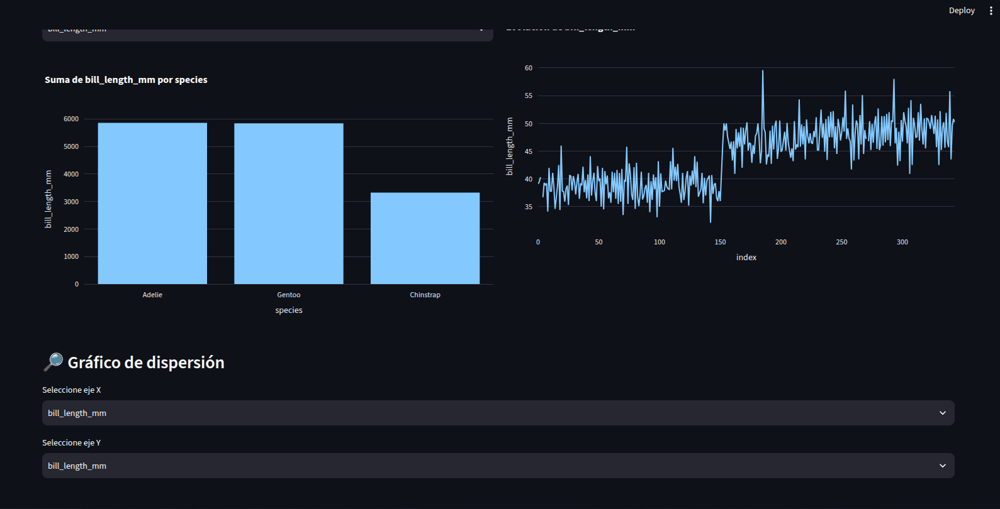
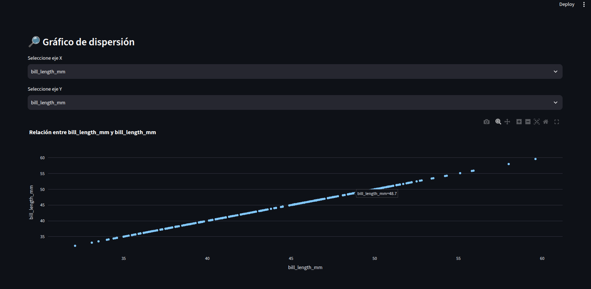
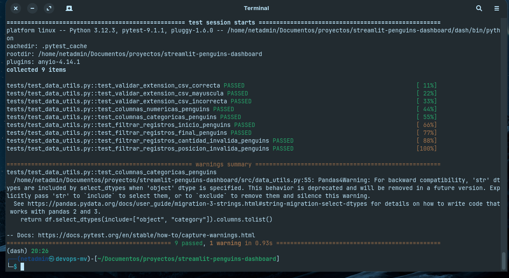
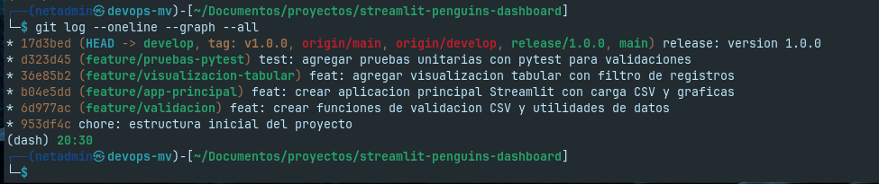

# 📋 Informe de Desarrollo

## 🏷️ Streamlit Penguins Dashboard — Análisis de Datos con Gitflow

---

### 👥 Integrantes

| 👤 Nombre | 🎓 Carrera |
|---|---|
| **Andre Yamada** | Ingeniería en Software — ESPOCH |
| **Ruperto Cisneros** | Ingeniería en Software — ESPOCH |

---

## 📌 1. Objetivo

Desarrollar una aplicación interactiva en **Streamlit** para el análisis exploratorio del dataset **Palmer Penguins**, aplicando el flujo de trabajo **Gitflow** para gestionar el control de versiones durante todo el ciclo de desarrollo.

---

## 🗺️ 2. Flujo Gitflow Utilizado

El proyecto fue desarrollado siguiendo estrictamente el modelo **Gitflow**, sin resolución de conflictos ni uso de la rama hotfix, tal como se indicó en los requerimientos de la tarea.

```
main ─────────────────────────────────────── ● v1.0.0
                                            ↑
release/1.0.0 ─────────────────────────── ●
                                            ↑
develop ── ● ── ● ── ● ── ● ── ● ─────── ●
            ↑    ↑    ↑    ↑
            │    │    │    └── feature/pruebas-pytest
            │    │    └─────── feature/visualizacion-tabular
            │    └──────────── feature/app-principal
            └───────────────── feature/validacion
```

> 🔑 **Cada funcionalidad se desarrolló en su propia rama `feature/*`**, se integró a `develop` mediante merge, y finalmente se publicó a `main` a través de `release/1.0.0` con el tag `v1.0.0`.

---

## 🔧 3. Procedimiento Paso a Paso

---

### 🟢 3.1 Preparación del Entorno

Se creó el directorio del proyecto, se inicializó el repositorio Git, se configuró el entorno virtual de Python y se instalaron las dependencias.

```bash
mkdir streamlit-penguins-dashboard
cd streamlit-penguins-dashboard
git init
python3 -m venv dash
source dash/bin/activate
pip install streamlit pandas plotly pytest
```

📦 **Dependencias instaladas:**

| Paquete | Versión | Propósito |
|---|---|---|
| Streamlit | 1.59+ | Framework de dashboards |
| Pandas | 3.0+ | Manipulación de datos |
| Plotly | 6.0+ | Gráficos interactivos |
| Pytest | 9.1+ | Pruebas unitarias |

✅ Se realizó el primer commit en `main` y se creó la rama `develop`:

```bash
git add .
git commit -m "chore: estructura inicial del proyecto"
git checkout -b develop
```

---

### 🔵 3.2 Feature 1: Funciones de Validación

> 📂 Rama: `feature/validacion`

Se implementó el archivo `src/data_utils.py` con cinco funciones utilitarias:

| # | Función | Descripción |
|---|---|---|
| 1 | `validar_extension_csv()` | Verifica que el archivo tenga extensión `.csv` |
| 2 | `cargar_csv()` | Carga un CSV probando codificaciones: utf-8, latin1, cp1252 |
| 3 | `obtener_columnas_numericas()` | Retorna las columnas de tipo numérico |
| 4 | `obtener_columnas_categoricas()` | Retorna las columnas de tipo texto/categoría |
| 5 | `filtrar_registros()` | Filtra los primeros o últimos N registros |

```bash
git checkout -b feature/validacion
# ... desarrollo de data_utils.py ...
git commit -m "feat: crear funciones de validacion CSV y utilidades de datos"
git checkout develop
git merge feature/validacion
```

---

### 🟣 3.3 Feature 2: Aplicación Principal Streamlit

> 📂 Rama: `feature/app-principal`

Se creó el archivo `app.py` con la aplicación principal que incluye:

- 📁 **Carga de archivos CSV** desde la barra lateral con validaciones.
- 📊 **Gráfico de barras** — Suma de valores numéricos agrupados por categoría.
- 📈 **Gráfico de líneas** — Evolución de una variable numérica.
- 🔎 **Gráfico de dispersión** — Relación entre dos variables numéricas.

#### 📸 Captura — Dashboard con gráficos de barras y líneas:



#### 📸 Captura — Gráfico de dispersión:



```bash
git checkout -b feature/app-principal
# ... desarrollo de app.py ...
git commit -m "feat: crear aplicacion principal Streamlit con carga CSV y graficas"
git checkout develop
git merge feature/app-principal
```

---

### 🟠 3.4 Feature 3: Visualización Tabular

> 📂 Rama: `feature/visualizacion-tabular`

Se agregó al final de `app.py` una sección de visualización tabular que permite:

- 🔢 Seleccionar la **cantidad de registros** a visualizar (de 1 hasta el total).
- 🔄 Elegir la **posición**: desde el **Inicio** o desde el **Final** del dataset.

```bash
git checkout -b feature/visualizacion-tabular
# ... desarrollo ...
git commit -m "feat: agregar visualizacion tabular con filtro de registros"
git checkout develop
git merge feature/visualizacion-tabular
```

---

### 🔴 3.5 Feature 4: Pruebas con Pytest

> 📂 Rama: `feature/pruebas-pytest`

Se implementaron **9 pruebas unitarias** en `tests/test_data_utils.py` que validan el correcto funcionamiento de todas las funciones utilitarias:

| # | Prueba | Qué valida | Resultado |
|---|---|---|---|
| 1 | `test_validar_extension_csv_correcta` | Archivo `.csv` es aceptado | ✅ PASSED |
| 2 | `test_validar_extension_csv_mayuscula` | Archivo `.CSV` también es aceptado | ✅ PASSED |
| 3 | `test_validar_extension_csv_incorrecta` | Archivo `.xlsx` es rechazado | ✅ PASSED |
| 4 | `test_columnas_numericas_penguins` | Detecta correctamente las columnas numéricas | ✅ PASSED |
| 5 | `test_columnas_categoricas_penguins` | Detecta correctamente las columnas categóricas | ✅ PASSED |
| 6 | `test_filtrar_registros_inicio_penguins` | Filtra los primeros N registros correctamente | ✅ PASSED |
| 7 | `test_filtrar_registros_final_penguins` | Filtra los últimos N registros correctamente | ✅ PASSED |
| 8 | `test_filtrar_registros_cantidad_invalida` | Lanza error con cantidad 0 | ✅ PASSED |
| 9 | `test_filtrar_registros_posicion_invalida` | Lanza error con posición no válida | ✅ PASSED |

#### 📸 Captura — Ejecución de pytest (9 tests pasados):



```bash
git checkout -b feature/pruebas-pytest
# ... desarrollo de tests ...
git commit -m "test: agregar pruebas unitarias con pytest para validaciones"
git checkout develop
git merge feature/pruebas-pytest
```

---

### 🏁 3.6 Release 1.0.0

Se creó la rama `release/1.0.0` desde `develop`, se realizó el merge hacia `main` y se etiquetó con el tag `v1.0.0`.

```bash
git checkout develop
git checkout -b release/1.0.0
git commit --allow-empty -m "release: version 1.0.0"

# Merge a main y creación del tag
git checkout main
git merge release/1.0.0
git tag -a v1.0.0 -m "Release version 1.0.0"
git push origin main
git push origin v1.0.0

# Merge de vuelta a develop
git checkout develop
git merge release/1.0.0
git push origin develop
```

#### 📸 Captura — Historial de Git con Gitflow completo:



---

## 📊 4. Resumen de Ramas y Commits

| Rama | Commit | Tipo |
|---|---|---|
| `main` | `chore: estructura inicial del proyecto` | Inicial |
| `feature/validacion` | `feat: crear funciones de validacion CSV y utilidades de datos` | Feature |
| `feature/app-principal` | `feat: crear aplicacion principal Streamlit con carga CSV y graficas` | Feature |
| `feature/visualizacion-tabular` | `feat: agregar visualizacion tabular con filtro de registros` | Feature |
| `feature/pruebas-pytest` | `test: agregar pruebas unitarias con pytest para validaciones` | Test |
| `release/1.0.0` | `release: version 1.0.0` | Release |

---

## 🧠 5. Conclusiones

### 📍 Conclusión 1 — Aislamiento de funcionalidades mediante ramas feature

Gitflow permite desarrollar cada funcionalidad de forma aislada en su propia rama `feature/*`, lo que evita que un error en una funcionalidad en desarrollo afecte al código estable de `develop` o `main`. En este proyecto, las funciones de validación, la aplicación principal, la visualización tabular y las pruebas se desarrollaron de forma independiente, y cada una fue integrada a `develop` solo cuando estaba completa y funcional. Este aislamiento reduce significativamente el riesgo de introducir regresiones en el código base.

### 📍 Conclusión 2 — Trazabilidad y control del historial de cambios

El uso de ramas nombradas con convención (`feature/`, `release/`) junto con mensajes de commit descriptivos que siguen el estándar Conventional Commits (`feat:`, `test:`, `release:`) genera un historial de Git que permite reconstruir exactamente qué se hizo, cuándo y por qué. Esto es especialmente valioso en equipos de trabajo donde múltiples desarrolladores contribuyen al mismo proyecto y necesitan entender el contexto de cada cambio sin tener que revisar el código línea por línea.

### 📍 Conclusión 3 — Separación clara entre desarrollo y producción

La rama `develop` actúa como zona de integración donde se prueban todas las funcionalidades juntas antes de promoverlas a `main` mediante un `release`. Esto garantiza que la rama `main` siempre contiene código estable, verificado y listo para producción. En un entorno profesional real, este modelo permite realizar despliegues controlados y predecibles, minimizando el impacto de errores en los usuarios finales. La rama `release` agrega una capa adicional de control al congelar el código para revisión final antes de la publicación.

---

## 🔗 6. Repositorios

| Integrante | URL del Repositorio |
|---|---|
| Andre Yamada | https://github.com/and95yam/streamlit-penguins-dashboard |
| Ruperto Cisneros | ** |

---

> 📅 **Fecha de entrega:** 8 de Julio del 2026
